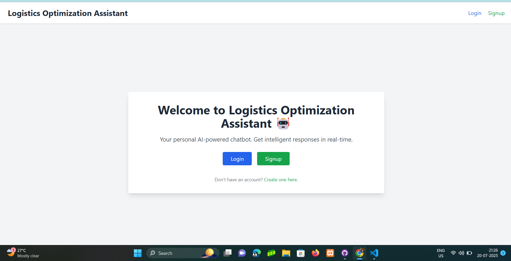
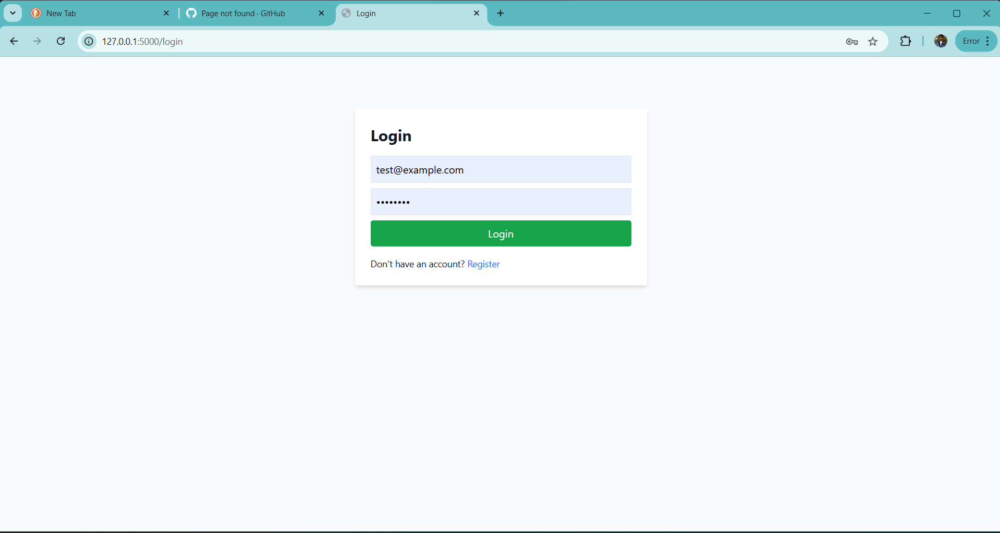
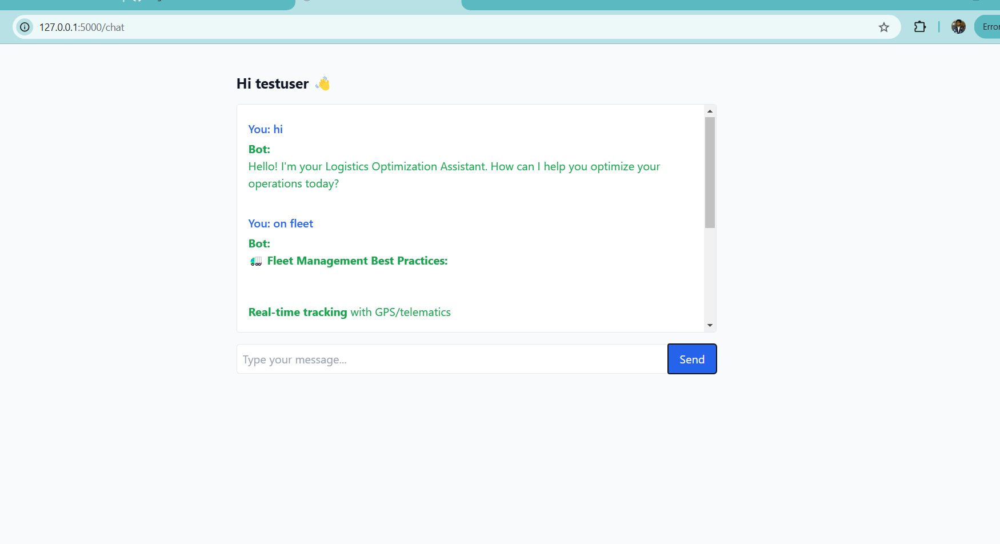
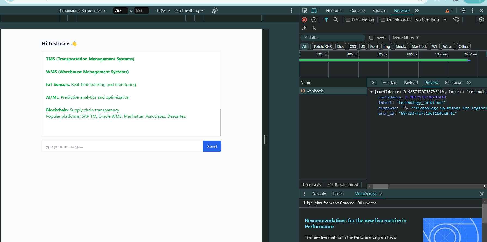

# 🚀 Rasa Chatbot Project

This is a sample Rasa chatbot project integrated with a Flask backend and MongoDB for storing chat data. Webhooks are triggered on every user message for further processing.

---

## 📁 Project Setup

1. **Create Virtual Environment**

```bash
python -m venv venv

# 2.Activate Virtual Environment

# On Windows

```sh
source venv/Scripts/activate
```

# On Unix or MacOS

```sh
source venv/bin/activate
```

# 3.Change to Project Directory

```sh
cd temp_rasa_project
```


# 4.Train Rasa Model

```
rasa train
```


# 5.Run Flask Backend
```py
python app.py
```
# Application Screenshots
 # #index page 


 


 ## sigup 
 

 ## login 

 


 ## chat 
 

 ## every chat i store in mongo and an webhook is call
 


  
 [link](https://photos.app.goo.gl/6fZXFpinWGYtt6gL7)